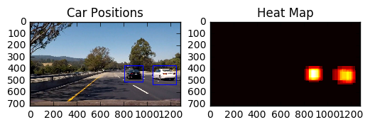

# Vehicle Detection

The Project
---

#### I started by reading in all the vehicle and non-vehicle images. Here is an example of one of each of the vehicle and non-vehicle classes:

#### During the interactive class assignments I played with the settings of the feature selection

I decided to use HOG, Spatial Features, and Histogram Features.  I originally made a mistake and trained the model in one color space, and tried to predict with another. I ended up switching both to RGB and things started working (with a validation score of 0.989).  Later, I decided to switch to YCrCb color space, and the score went up to 0.9907.  This seemed to create a lot less false positives in the real data. Unfortunately a lot of my hand tweaked thresholds needed to be reset. 

The parameters are on Lines 208-217 of vehicledetect.py

#### I probably made a mistake and jumped straight to the Hog Sub-sampling Window Search optimization

I am using 5 different windows. This is really slow. I think it would be better if I had started with the simple sliding window technique, and then optimized it afterwards.  In addition, to speed things up I could skip every so many frames, and reduce my search area to a zone around where we detected cars in the last frame.  The HOG optimization code I copied from the video exercise didn't easily allow a reduction in the x coorinate space.  I decided not to spend time optimizing this technique, because I wanted to spend more time exploring deep learning techniques. (See below)

Below are the five different search box sizes and ranges:

settings are on lines 401-405 of vehicledetect.py

This is a combination of all of the found boxes on a sample image:

#### False Positive Rejection

Lines 419-440 vehicledetect.py

I used two techniques to try to remove false positives. Before I fixed my SVM training, I was getting a lot more false positives. I decided to analyze them two ways.  First, I started to keep track of the probability from the predict function. Second, I used a Canny line algorithm to see how many lines were in the image.  For the Canny I used the ratio of Canny pixels vs. the pixels in the image.

A star next to the value means it is above the threshold:

#####decision: [ 1.5012129] *  pc: 0.0864453125 *

* Keep this one

#####decision: [ 1.65981313] *  pc: 0.093671875 *

* Keep this one

#####decision: [ 0.34632849]   pc: 0.08642578125 *
* reject this one - lots of lines, low decision probability

####This is what the bounding boxes and heatmap look like:
(not all the railings were rejected, but the heatmap is a very low level)

####  Here are 5 frames and their corresponding heatmaps

I save the last 5 frames of bounding boxes. I create heatmaps from them, but use the current frame 3 times to strengthen the weight of what is happening now. I then threshold the heatmap and create the labels. This seems to work well to get rid of false positives, as well as dampen the motion.

### Summary for Traditonal OpenCV approach

There are a couple of parts of this that I am not completely happy with. Unfortunately, when I change around the sliding windows, or retrain the SVC it means I have to trial and error different values of the false positive filter, and the heatmap threshold. This means it probably doesn't generalize as well as I would like either. If my classifier worked better from the beginning, I probably wouldn't have added this filtering. It might be causing more problems than it is worth. I think it is causing the car boxes to be too small right now.

#### Here is a link to the completed video:
 [video of opencv approach](./project_video_out.mp4)
 
 [youtube opencv link](https://youtu.be/coEj3h9P2Vg)

### Next Steps

1. With the current algorithm, I would like to do some more experiments, and write some code to pick the optimally small windows. Also, I don't think I need 5 passes, I can probably get away with 2.  
2. To speed it up, we could skip the search and only search once every 5 or so frames. In between frames we could search only around where we expect the cars to be in the next frame. The hard part of this, is that the HOG optimization code, makes it a bit complicated to limit the window in the x direction. It is of course possible, but requires a good deal of refactoring

## DEEP LEARNING SOLUTION (bonus?)

### 1. Heatmaps from Convnets

I used code from this github repo to try to create a heatmap of the location of the cars.

[https://github.com/heuritech/convnets-keras](https://github.com/heuritech/convnets-keras)

Here is the output of the test images:

At first this seemed to be fairly quick. Unfortuantely I wasn't getting very many pixels out of the heatmap. I haven't read through all the code and papers to see if there is a way to get a higher resolution heatmap or if it is a limitation of the way it is built.  I ended up doubling the frame and I was able to get a little more resolution: 
73 x 38 pixels.  There is probably more work that could be done to change the thresholds, etc.  I also tried to take a low threshold area, and then run it back through and create another heatmap.  This is also generating an even lower resolution heatmap.  Maybe it would work of I doubled or 10x the input size?  I think I need to read the papers and look at the technique more carefully. 

This code is in convnet-vehicledetect.py  -- it is really short and simple. It requires the github repo above as a library. Also, it requires the alexnet weights. A link is in that repo.  

 [video of convnets approach](./project_video_convnets_out.mp4)
  [youtube convnets link](https://youtu.be/JZWOHDbtRNg)

### 2. Faster-RCNN_TF

This approach works amazingly well. It will also classify people, bikes, and motorcycles and label them as well.

[https://github.com/smallcorgi/Faster-RCNN_TF](https://github.com/smallcorgi/Faster-RCNN_TF)

faster-rcnn-vehicledetect.py  -- this code is super simple as well. It requires the github repo above, and seems to only work on python 2 not 3. It requires a download of VGG weights.

[video of faster-rcnn approach](./project_video_faster-rcnn-out.mp4)
[youtube faster rcnn link](https://youtu.be/dLwdY0S_8DY)
### Links to Data to keep testing and improving (from Udacity):

Here are links to the labeled data for [vehicle](https://s3.amazonaws.com/udacity-sdc/Vehicle_Tracking/vehicles.zip) and [non-vehicle](https://s3.amazonaws.com/udacity-sdc/Vehicle_Tracking/non-vehicles.zip) examples to train your classifier.  These example images come from a combination of the [GTI vehicle image database](http://www.gti.ssr.upm.es/data/Vehicle_database.html), the [KITTI vision benchmark suite](http://www.cvlibs.net/datasets/kitti/), and examples extracted from the project video itself.   You are welcome and encouraged to take advantage of the recently released [Udacity labeled dataset](https://github.com/udacity/self-driving-car/tree/master/annotations) to augment your training data.  

Some example images for testing your pipeline on single frames are located in the `test_images` folder.  To help the reviewer examine your work, please save examples of the output from each stage of your pipeline in the folder called `ouput_images`, and include them in your writeup for the project by describing what each image shows.    The video called `project_video.mp4` is the video your pipeline should work well on.  

